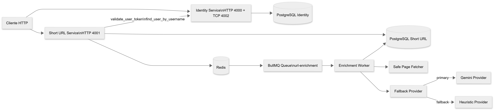
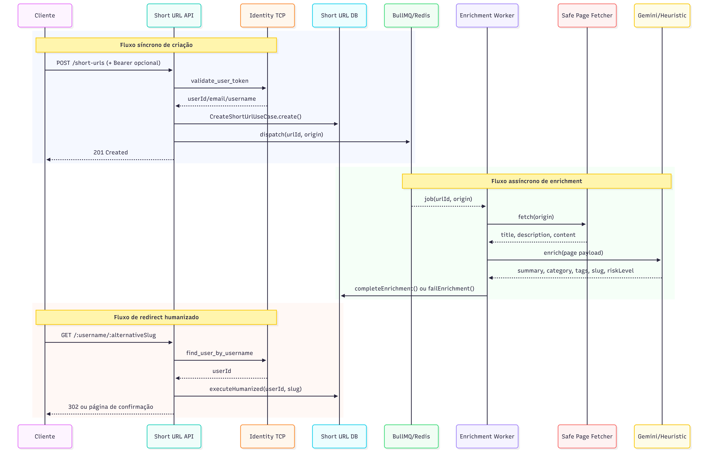

# secure-url-shortener

> Portuguese version: see [README.md](./README.md).

Monorepo with two NestJS microservices for secure URL shortening, authentication, asynchronous destination enrichment, and risk-gated redirect flows.

## What the project delivers

- `Identity`: registration, login, authenticated profile, JWT validation, and public user lookup by `username`.
- `Short-url`: short-link creation, user-scoped listing, single-item lookup, update, soft deletion, stats, and redirect flows.
- Link creation with optional authentication: anonymous or tied to the authenticated user.
- Asynchronous enrichment with `summary`, `category`, `tags`, `alternativeSlug`, `riskLevel`, and `provider`.
- Human-friendly route based on `username + alternativeSlug`.
- HTML confirmation screen before redirect when the destination is classified with `riskLevel=high`.
- Service-to-service communication through Nest TCP between `Short-url` and `Identity`.

## Technical value

From an architecture and interview perspective, this project demonstrates:

- clear boundaries between identity and URL domains;
- a short synchronous write path and an asynchronous path for heavier processing;
- explicit contracts between distributed services;
- AI integration treated as infrastructure detail;
- deterministic fallback when the primary provider fails;
- operational readiness through HTTP health checks and explicit `docker-compose` dependencies;
- explicit security concerns during both content fetch and public redirect.

## Route documentation

- HTTP routes and internal contracts: [ROUTES.md](./ROUTES.md)
- Identity Swagger: `http://localhost:4000/api-docs`
- Short URL Swagger: `http://localhost:4001/api-docs`

## Technical stack

- NestJS
- Fastify
- TypeScript
- PostgreSQL
- Redis
- BullMQ
- TypeORM
- Docker Compose
- Yarn 4 Workspaces
- Google Gemini as the primary enrichment provider

## Technical architecture drawing

### Distributed service topology



### Use-case flow + queue + distributed services



## Monorepo structure

```text
apps/
  identity/
  short-url/
```

Each app follows this split:

- `domain`
- `application`
- `infra`
- `presentation`

## Architectural view

### `IDENTITY`

Responsible for:

- creating users with `email`, `password`, and `username`;
- authenticating users and issuing JWTs;
- validating tokens consumed by `short-url`;
- resolving `username -> userId` for the humanized route.

`identity` is the source of truth for authentication and public identity. This avoids duplicating registration, token validation, and user lookup inside the link service.

### `SHORT_URL`

Responsible for:

- shortening URLs;
- keeping optional ownership for authenticated users;
- listing links owned by the authenticated user;
- retrieving one specific link owned by the authenticated user;
- allowing single-item lookup and stats for anonymous links without authentication;
- updating the destination and clearing previous enrichment data;
- soft deleting links;
- enriching destinations in the background;
- redirecting by `code` or humanized route;
- requiring explicit confirmation when enrichment indicates high risk.

`short-url` owns the link domain and delegates authentication to `identity`, keeping the context boundary explicit.

## End-to-end flow

### 1. Registration and authentication

- The user registers with `email`, `password`, and `username`.
- `username` is normalized to lowercase and must be unique.
- Login returns a JWT carrying `sub`, `email`, and `username`.
- `short-url` uses that token for authenticated operations.

### 2. Short-link creation

- `POST /short-urls` accepts optional authentication.
- The short URL is created immediately with an 8-character alphanumeric `code`.
- Create response time does not depend on enrichment.
- After persistence, the application sends a job to the enrichment queue.

### 3. Asynchronous queue dispatch

The BullMQ dispatcher schedules the job with:

- an initial 5-second delay;
- up to 5 attempts;
- exponential backoff;
- bounded history through `removeOnComplete` and `removeOnFail`.

### 4. Safe page-content fetch

The worker fetches the original page content before enriching it.

The fetcher:

- uses browser-assisted page fetch through `Impit` as the default strategy;
- accepts only `http` and `https`;
- rejects `localhost`, private ranges, and unsafe hosts;
- applies a configurable timeout;
- extracts `title`, `meta description`, and cleaned HTML text content;
- falls back to minimal metadata when the response is not `text/html`.

### 5. Enrichment pipeline

1. URL creation schedules a BullMQ job.
2. The worker fetches destination metadata and page content.
3. The composed provider tries to enrich the URL.
4. The result persists `summary`, `category`, `tags`, `alternativeSlug`, `riskLevel`, and `provider`.

Core files in this flow:

- Queue dispatcher: [bullmq-url-enrichment-job.dispatcher.ts](./apps/short-url/src/infra/queue/bullmq-url-enrichment-job.dispatcher.ts)
- Worker: [url-enrichment.worker.ts](./apps/short-url/src/infra/enrichment/workers/url-enrichment.worker.ts)
- Page-content fetcher: [url-page-content-fetcher.service.ts](./apps/short-url/src/infra/enrichment/services/url-page-content-fetcher.service.ts)
- Fallback provider: [fallback-url-enrichment.provider.ts](./apps/short-url/src/infra/enrichment/providers/fallback-url-enrichment.provider.ts)
- Gemini provider: [gemini-url-enrichment.provider.ts](./apps/short-url/src/infra/enrichment/providers/gemini-url-enrichment.provider.ts)
- Heuristic provider: [heuristic-url-enrichment.provider.ts](./apps/short-url/src/infra/enrichment/providers/heuristic-url-enrichment.provider.ts)

### 6. Destination update

- `PATCH /short-urls/:shortUrlCode` requires authentication and link ownership.
- The origin URL is updated.
- Stored enrichment is cleared and set back to `pending`.
- Previous `summary`, `category`, `tags`, `alternativeSlug`, `provider`, `riskLevel`, `error`, and `enrichedAt` values are discarded.

### 7. Authenticated stats

- `GET /short-urls/:shortUrlCode/stats`
- Returns `totalClicks`, average clicks per day, link age, enrichment state, attempts, `riskLevel`, `provider`, and whether the humanized route is available.
- Useful for an operational dashboard without requiring a full events table.

### 8. Classic redirect

- `GET /:shortUrlCode`
- If the URL does not have high-risk enrichment, it returns `302` and tracks the click.
- If the URL has `riskLevel=high`, it returns an HTML warning page.
- The `proceed` query parameter accepts `1`, `true`, or `yes` to force continuation.

### 9. Humanized redirect

- `GET /:username/:alternativeSlug`
- Resolves `username` in `identity`.
- Finds the owner URL whose enrichment produced the `alternativeSlug`.
- Applies the same security rule as the classic redirect.

## Service communication

`short-url` depends on `identity` for two internal Nest TCP contracts:

- `validate_user_token`
- `find_user_by_username`

In practice:

- authenticated requests arrive at `short-url`;
- the guard calls `identity`;
- `identity` validates the JWT and returns `userId`, `email`, and `username`;
- the humanized route calls `identity` to resolve `username -> userId`.

## Relevant security rules

- `identity` requires a unique `username` at registration.
- The accepted registration `username` must be 3 to 30 characters, lowercase, using letters, numbers, hyphen, or underscore.
- The `shortUrlCode` accepted by protected and public routes must be exactly 8 alphanumeric characters.
- Content fetch rejects unsafe protocols and hosts.
- `short-url` does not auto-redirect URLs with `riskLevel=high`.
- A click is only tracked when the redirect actually happens.

## Requirements

- Node.js 20+
- Corepack enabled
- Yarn 4
- Docker
- Docker Compose

## Initial setup

1. Clone the repository.
2. Copy the environment variables.
3. Install dependencies.

```bash
cp .env.example .env
corepack enable
yarn install
```

## Environment variables

The project uses a single `.env` file at the monorepo root.

Most relevant groups:

- API
  - `PORT_IDENTITY`
  - `PORT_SHORT_URL`
  - `PORT_IDENTITY_TCP`
  - `HOST_IDENTITY_TCP`
- JWT
  - `JWT_SECRET`
  - `JWT_EXPIRATION`
- AI / enrichment
  - `AI_ENRICHMENT_ENABLED`
  - `AI_PAGE_MAX_CHARS`
  - `AI_PAGE_FETCH_TIMEOUT_MS`
- Gemini
  - `GEMINI_API_KEY`
  - `GEMINI_MODEL`
- Redis
  - `REDIS_HOST`
  - `REDIS_PORT`
  - `REDIS_PASSWORD`
- `identity` database
  - `DB_IDENTITY_*`
- `short-url` database
  - `DB_SHORT_URL_*`

Use [.env.example](./.env.example) as the baseline.

## Running with Docker

Start the full stack:

```bash
docker compose up --build
```

Exposed services:

- Identity HTTP: `http://localhost:4000`
- Identity TCP: `localhost:4002`
- Identity health: `http://localhost:4000/health`
- Short URL HTTP: `http://localhost:4001`
- Short URL health: `http://localhost:4001/health`
- Identity Swagger: `http://localhost:4000/api-docs`
- Short URL Swagger: `http://localhost:4001/api-docs`

`docker-compose` now also waits for `postgres`, `redis`, and `identity` to become healthy before starting `short-url`.

Stop the stack:

```bash
docker compose down
```

Stop and remove volumes:

```bash
docker compose down -v
```

## Running locally

Start infrastructure only:

```bash
docker compose up postgres-identity postgres-short-url redis -d
```

Run the apps separately:

```bash
yarn start:identity:dev
yarn start:url:dev
```

Run both together:

```bash
yarn start:dev
```

## Build

All workspaces:

```bash
yarn build
```

Build per app:

```bash
yarn workspace @secure-url-shortener/identity build
yarn workspace @secure-url-shortener/short-url build
```

## Tests

All workspace tests:

```bash
yarn test
yarn test:unit
yarn test:e2e
```

Per app:

```bash
yarn workspace @secure-url-shortener/identity test
yarn workspace @secure-url-shortener/short-url test
```

Coverage per app:

```bash
yarn workspace @secure-url-shortener/identity test:cov
yarn workspace @secure-url-shortener/short-url test:cov
```

E2E per app:

```bash
yarn workspace @secure-url-shortener/identity test:e2e
yarn workspace @secure-url-shortener/short-url test:e2e
```

The tests mainly cover:

- DTO validation;
- authentication guards;
- authentication payloads;
- `username` lookup;
- classic redirect;
- humanized redirect;
- HTML warning page for high-risk URLs.

## Lint and formatting

```bash
yarn lint
yarn format
```

Per app:

```bash
yarn workspace @secure-url-shortener/identity lint
yarn workspace @secure-url-shortener/short-url lint
```

## Notes

- The database schema is synchronized automatically outside production (`synchronize`).
- Enrichment only runs when `AI_ENRICHMENT_ENABLED=true`.
- With the pipeline enabled, the composed provider tries Gemini first and falls back to heuristics if the primary provider fails.
- The persisted `provider` in `url_enrichments` shows which engine produced the final enrichment (`gemini` or `heuristic`).
